# Color-Sorting-Robot-Arm-4-DoF-CNN-OpenCV

A computer vision-based automatic color sorting robot arm using **Raspberry Pi 4, OpenCV, Convolutional Neural Network (CNN), and four SG90 servo motors**.

The system captures objects using a webcam, classifies their color using a trained CNN model, and automatically controls a 4 Degree of Freedom (DoF) robot arm to place the detected object into the corresponding color category.

---

## List of Content

- [Introduction](#Introduction)
- [Literature](#Literature)
  - [Raspberry Pi 4](#Raspberry-Pi-4)
  - [Computer Vision](#Computer-Vision)
  - [OpenCV](#OpenCV)
  - [Convolutional Neural Network (CNN)](#Convolutional-Neural-Network-CNN)
  - [Robot Arm 4 DoF](#Robot-Arm-4-DoF)
  - [Servo Motor](#Servo-Motor)
  - [Webcam](#Webcam)
- [Design](#Design)
  - [Hardware Design](#Hardware-Design)
  - [Software Design](#Software-Design)
  - [System Workflow](#System-Workflow)
- [Programs](#Programs)
  - [Dataset Collection](#Dataset-Collection)
  - [CNN Training](#CNN-Training)
  - [Color Classification and Robot Control](#Color-Classification-and-Robot-Control)
- [Installation](#Installation)
- [Result](#Result)
  - [Training Result](#Training-Result)
  - [Color Classification](#Color-Classification)
  - [Robot Arm Sorting](#Robot-Arm-Sorting)

---

## Introduction

Automatic object sorting is an application of robotics and computer vision in which objects are identified according to specific characteristics and then moved to their corresponding locations.

In this project, a **4 Degree of Freedom (DoF) robot arm** is developed for automatic color sorting using **Raspberry Pi 4** as the main computing platform. A webcam is used to capture the object, while **OpenCV** processes the camera image and a **Convolutional Neural Network (CNN)** classifies the detected object.

The classification system uses five classes:

- **Blue**
- **Black**
- **Yellow**
- **Red**
- **Null** — no object detected

The trained CNN model is stored as `best_model.keras` and loaded by the Raspberry Pi during the sorting process.

After the object color is classified, the corresponding color label is used to determine the movement sequence of four SG90 servo motors. The robot arm then moves the object to the appropriate sorting location.

The main goal of this project is to integrate **deep learning, computer vision, Raspberry Pi, and robotic arm control** into an automatic color sorting system.

---

## Literature

### Raspberry Pi 4

<p align="center">
  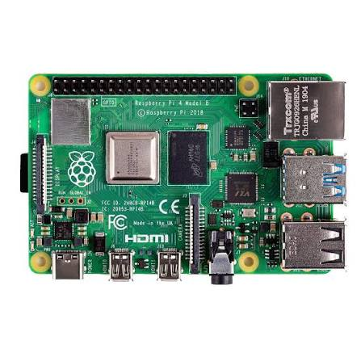
</p>

Raspberry Pi 4 is a single-board computer that can be used as a computing and control platform for robotics, automation, and computer vision applications.

In this project, Raspberry Pi 4 performs several important functions:

- Running the Python program
- Processing webcam images
- Loading the trained CNN model
- Performing color classification
- Generating PWM signals
- Controlling the four servo motors

The Raspberry Pi is connected to the robot arm and webcam and operates with a Raspberry Pi OS/Raspbian environment.

---

### Computer Vision

Computer vision is a field that enables computers to obtain information from digital images or video.

In this project, computer vision is used to obtain visual information from the webcam and provide image data to the CNN classification model.

The camera continuously captures the sorting area so that the system can determine whether an object is present and identify its color.

---

### OpenCV

<p align="center">
  
</p>

OpenCV (Open Source Computer Vision Library) is an open-source library commonly used for image processing and computer vision.

In this project, OpenCV is used for:

- Capturing webcam frames
- Reading image data
- Resizing images
- Preparing images for CNN classification
- Displaying the webcam interface
- Processing real-time camera input

The dataset images are resized to **100 × 100 pixels** before being used by the CNN model.

---

### Convolutional Neural Network (CNN)

<p align="center">
  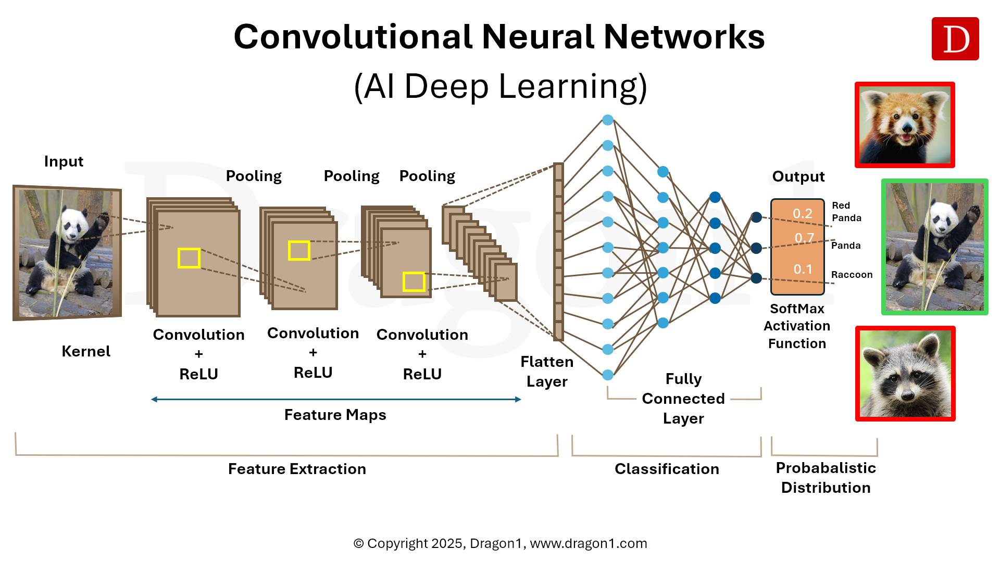
</p>

A Convolutional Neural Network (CNN) is a deep learning architecture commonly used for image classification.

The CNN learns visual features from the dataset and uses these features to classify an input image into one of the predefined classes.

The model used in this project consists of:

| Layer | Configuration |
|:---|:---|
| Input | 100 × 100 × 3 |
| Convolution | 32 filters, 3 × 3, ReLU |
| Max Pooling | 2 × 2 |
| Convolution | 64 filters, 3 × 3, ReLU |
| Max Pooling | 2 × 2 |
| Convolution | 128 filters, 3 × 3, ReLU |
| Max Pooling | 2 × 2 |
| Flatten | - |
| Dense | 128 neurons, ReLU |
| Output | 5 classes, Softmax |

The model uses the **Adam optimizer**, `categorical_crossentropy` as the loss function, and accuracy as the evaluation metric.

The dataset is divided into training and testing data using an **80:20 split**, while image pixel values are normalized by dividing them by 255.

---

### Robot Arm 4 DoF

<p align="center">
  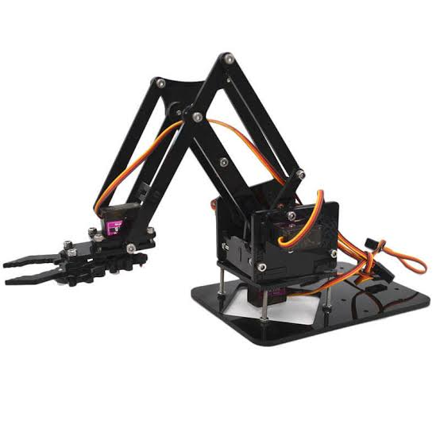
</p>

A 4 Degree of Freedom robot arm consists of four independently controlled servo-driven movements.

The robot arm in this project is used to pick up the detected object and place it into a location corresponding to its color.

The mechanical system uses an acrylic 4 DoF robot arm kit with four SG90 servo motors.

---

### Servo Motor

<p align="center">
  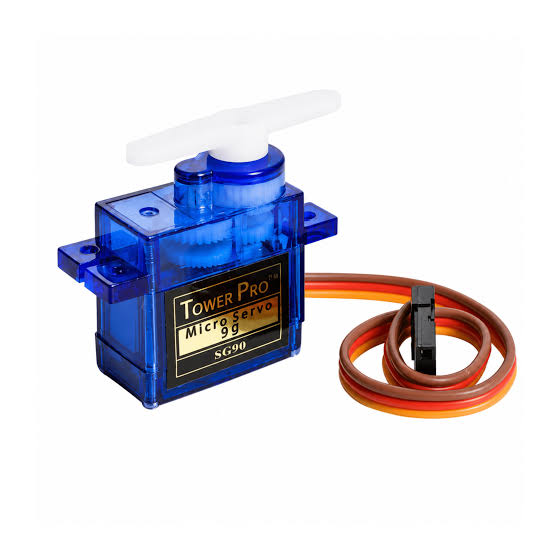
</p>

The **SG90 servo motor** is used as the actuator for the robot arm.

Four servo motors are controlled by Raspberry Pi GPIO pins:

| Servo | GPIO | Main Function |
|:---:|:---:|:---|
| **Servo 1** | GPIO 17 | Gripper / object handling |
| **Servo 2** | GPIO 27 | Arm movement |
| **Servo 3** | GPIO 22 | Arm movement |
| **Servo 4** | GPIO 23 | Horizontal movement |

The servos operate using a PWM frequency of **50 Hz**.

---

### Webcam

<p align="center">
  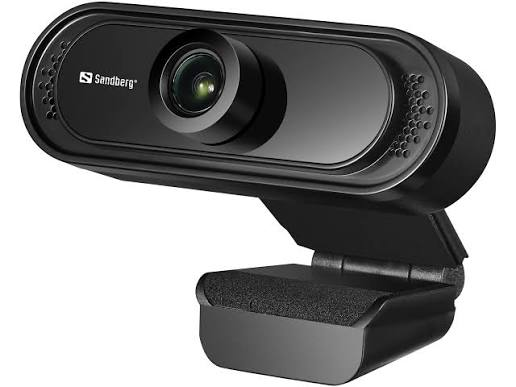
</p>

The webcam is used as the visual input device for the color sorting system.

The webcam is positioned perpendicular to the sorting area so that the object can be captured consistently. During real-time operation, the camera captures frames and sends them to the CNN model for classification.

The documented implementation uses a webcam connected to the Raspberry Pi and configures the camera frame at **320 × 240 pixels** for real-time classification.

---

## Design

The system consists of two main parts:

1. **Hardware Design**
2. **Software Design**

The hardware performs object manipulation, while the software performs image acquisition, CNN classification, and servo control.

---

### Hardware Design

<p align="center">
  
</p>

The hardware consists of:

- Raspberry Pi 4
- 4 DoF robot arm
- 4 × SG90 servo motors
- Webcam
- Monitor display
- Jumper wires
- Power supply
- Color sorting boxes

The Raspberry Pi communicates directly with the four servo motors through GPIO pins.

The webcam is mounted above the sorting area, while the robot arm is positioned so that it can pick up objects and move them into the corresponding color boxes.

The main hardware components are:

| Component | Quantity | Function |
|:---|:---:|:---|
| 🤖 **Robot Arm 4 DoF** | 1 | Manipulates objects |
| 🖥️ **Raspberry Pi 4** | 1 | Main controller |
| 📷 **Webcam** | 1 | Captures object images |
| ⚙️ **SG90 Servo Motor** | 4 | Controls robot arm movement |
| 🖥️ **Monitor Display** | 1 | Raspberry Pi interface |
| 🔌 **Jumper Wires** | As required | Electrical connections |
| 📦 **Sorting Boxes** | 4+ | Stores sorted objects |

---

### Software Design

The software system uses:

- Python
- OpenCV
- NumPy
- TensorFlow / Keras
- RPi.GPIO
- Scikit-learn
- Seaborn
- Matplotlib

The CNN model is trained separately using the collected dataset. The resulting model is saved as:

```text
best_model.keras
```

During real-time operation, the Raspberry Pi loads this model and uses it to classify webcam images.

---

### System Workflow

```text
                  ┌──────────────────┐
                  │      Webcam      │
                  └────────┬─────────┘
                           │
                           ▼
                  ┌──────────────────┐
                  │     OpenCV       │
                  │ Image Processing │
                  └────────┬─────────┘
                           │
                           ▼
                  ┌──────────────────┐
                  │   CNN Model      │
                  │ best_model.keras │
                  └────────┬─────────┘
                           │
                           ▼
              ┌──────────────────────────┐
              │   Color Classification   │
              │                          │
              │ Blue / Black / Yellow / │
              │ Red / Null               │
              └────────────┬─────────────┘
                           │
                           ▼
                  ┌──────────────────┐
                  │ Servo Movement   │
                  │  Raspberry Pi    │
                  └────────┬─────────┘
                           │
                           ▼
                  ┌──────────────────┐
                  │  4 DoF Robot Arm │
                  └────────┬─────────┘
                           │
                           ▼
                  ┌──────────────────┐
                  │  Sorting Box     │
                  │ Based on Color   │
                  └──────────────────┘
```

---

## Programs

The software development is divided into three main stages:

1. **Dataset Collection**
2. **CNN Training**
3. **Real-Time Color Classification and Robot Control**

---

### Dataset Collection

The dataset is collected using a webcam and Python OpenCV.

Five folders are prepared:

```text
dataset/
├── biru/
├── hitam/
├── kuning/
├── merah/
└── null/
```

The `null` class represents the condition when there is no object in the sorting area.

The dataset collection process is:

1. Select the object/color class.
2. Select the number of samples.
3. Select the webcam index.
4. Start the webcam.
5. Place the object in front of the camera.
6. Press the `s` key to save an image.
7. Repeat until the desired number of samples is obtained.
8. Repeat the process for each class.

Example:

```python
import cv2
import os

def create_directory(directory):
    if not os.path.exists(directory):
        os.makedirs(directory)

def capture_images(parent_directory, object_name, num_samples, camera_index):
    directory = os.path.join(parent_directory, object_name)
    create_directory(directory)

    cap = cv2.VideoCapture(camera_index)
    count = 0
```

---

### CNN Training

The collected images are loaded from the dataset directory.

Each image is:

1. Read using OpenCV.
2. Resized to **100 × 100 pixels**.
3. Converted into a numerical array.
4. Assigned to its corresponding class label.
5. Normalized to a range of approximately 0–1.

The dataset is divided into:

```text
80% → Training data
20% → Testing data
```

The CNN model is implemented using Keras:

```python
model = Sequential([
    Conv2D(32, (3, 3), activation='relu',
           input_shape=(100, 100, 3)),
    MaxPooling2D((2, 2)),

    Conv2D(64, (3, 3), activation='relu'),
    MaxPooling2D((2, 2)),

    Conv2D(128, (3, 3), activation='relu'),
    MaxPooling2D((2, 2)),

    Flatten(),

    Dense(128, activation='relu'),
    Dense(5, activation='softmax')
])
```

The model is compiled using:

```python
model.compile(
    optimizer='adam',
    loss='categorical_crossentropy',
    metrics=['accuracy']
)
```

Training is performed for **50 epochs** with a **batch size of 32**.

The best model based on validation accuracy is saved as:

```text
best_model.keras
```

---

### Color Classification and Robot Control

The trained model is loaded using:

```python
model = load_model("best_model.keras")
```

The classification labels are:

```python
label_to_index = {
    0: 'biru',
    1: 'hitam',
    2: 'kuning',
    3: 'merah',
    4: 'null'
}
```

The Raspberry Pi GPIO configuration is:

```python
servo_pins = {
    'servo1': 17,
    'servo2': 27,
    'servo3': 22,
    'servo4': 23
}
```

The servo motors use a PWM frequency of 50 Hz.

The duty cycle is calculated using:

```python
duty_cycle = (angle / 18.0) + 2.5
```

The classified color determines the servo movement sequence.

---

## Installation

### Requirements

Hardware:

- Raspberry Pi 4
- Raspberry Pi OS / Raspbian
- 4 DoF robot arm
- 4 × SG90 servo motors
- Webcam
- Monitor
- Keyboard and mouse
- Jumper wires
- Power supply
- Sorting boxes

Software:

- Python 3
- OpenCV
- NumPy
- TensorFlow
- Keras
- RPi.GPIO
- Scikit-learn
- Seaborn
- Matplotlib

---

### Install Python Libraries

Install OpenCV:

```bash
pip install opencv-python
```

Install NumPy:

```bash
pip install numpy
```

Install TensorFlow:

```bash
pip install tensorflow
```

Install Scikit-learn:

```bash
pip install scikit-learn
```

Install Seaborn:

```bash
pip install seaborn
```

Install Matplotlib:

```bash
pip install matplotlib
```

Install Raspberry Pi GPIO:

```bash
pip install RPi.GPIO
```

---

## Running the Program

### 1. Prepare the Dataset

Place the dataset in:

```text
dataset/
```

with the following folder structure:

```text
dataset/
├── biru/
├── hitam/
├── kuning/
├── merah/
└── null/
```

### 2. Train the CNN Model

Run the training program:

```bash
python3 train_model.py
```

After training, the best model should be available as:

```text
best_model.keras
```

### 3. Prepare the Raspberry Pi

Connect:

- Webcam
- Four servo motors
- Monitor
- Keyboard
- Mouse

Make sure the webcam is correctly connected and the camera index in the program matches the connected webcam.

### 4. Run the Color Sorting Program

Run:

```bash
python3 color_sorting.py
```

The webcam interface will appear and the system will begin classifying objects in real-time.

### 5. Test the Sorting System

Place one of the supported colored objects in the detection area:

- Yellow
- Blue
- Red
- Black

The CNN model will classify the object, and the robot arm will move according to the detected color.

---

## Result

### Training Result

<p align="center">
  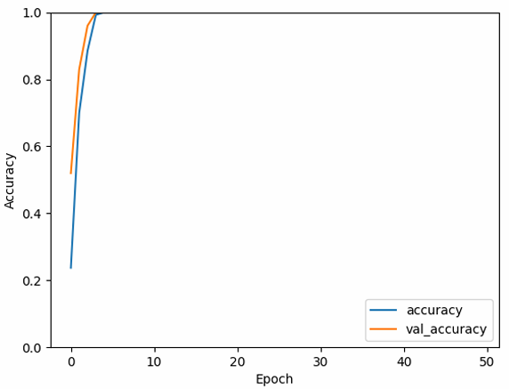
</p>

The accuracy graph shows the performance of the CNN model during training. Based on the documented training result, the model reached approximately **100% accuracy** during the 50 training epochs.

The training result indicates that the CNN was able to learn the visual patterns of the dataset effectively.

---

### Loss Result

<p align="center">
  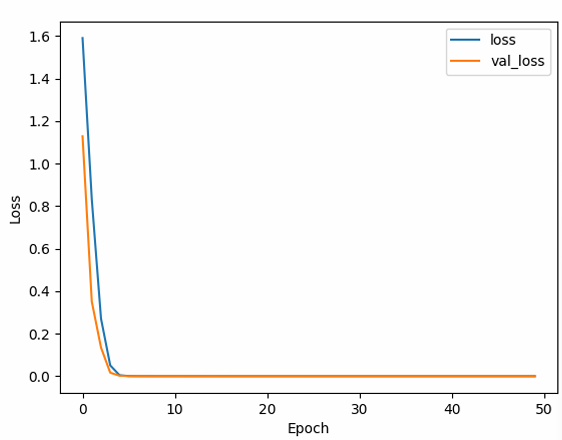
</p>

The loss graph represents the error produced by the model during the learning process.

The documented result shows that the error reached approximately **0.0**, corresponding to approximately **0% error** during the reported training process.

---

### Confusion Matrix

<p align="center">
  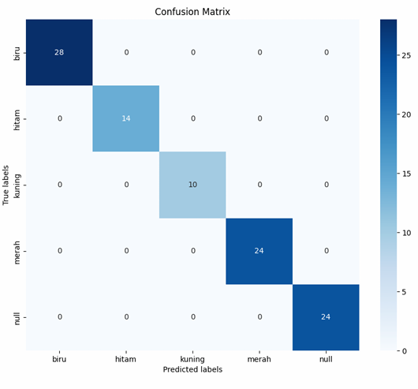
</p>

A confusion matrix is generated to evaluate the classification results for the five classes:

| Class | Description |
|:---:|:---|
| **Blue** | Blue object |
| **Black** | Black object |
| **Yellow** | Yellow object |
| **Red** | Red object |
| **Null** | No object |

The confusion matrix is generated using the test dataset and is used to observe whether samples are correctly classified into their corresponding classes.

---

### Color Classification

<p align="center">
  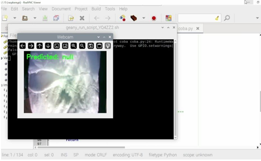
</p>

During real-time testing, the webcam interface displays the detected classification.

The tested object colors are:

| Test | Object |
|:---:|:---|
| 1 | Yellow |
| 2 | Blue |
| 3 | Red |
| 4 | Black |

The system classifies the object automatically based on the visual input captured by the webcam.

---

### Servo Calibration

The servo positions are calibrated for each color category.

| Servo | Yellow | Red | Blue | Black | Null |
|:---|---:|---:|---:|---:|---:|
| **Servo 1** | 143° | 10° | 45° | 180° | 90° |
| **Servo 2** | 80° | 80° | 80° | 80° | 90° |
| **Servo 3** | 60° | 60° | 60° | 60° | 90° |
| **Servo 4** | 45° | 45° | 45° | 45° | 90° |

The robot first moves from its initial position toward the object, then the gripper position changes according to the detected color. After the object is moved, the arm returns to its defined final position.

---

### Robot Arm Sorting

#### Yellow Object

<p align="center">
  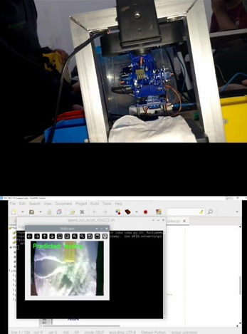
</p>

<p align="center">
  
</p>

The robot detects the yellow object and moves it toward the designated yellow sorting location.

---

#### Blue Object

<p align="center">
  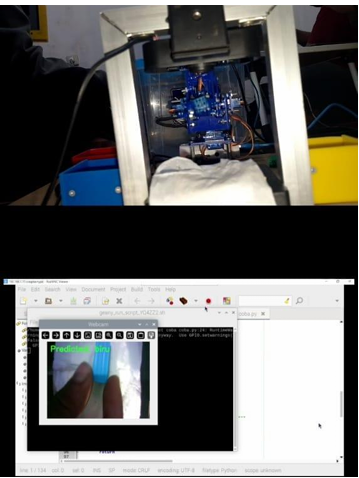
</p>

<p align="center">
  
</p>

The robot detects the blue object and moves it toward the designated blue sorting location.

---

#### Red Object

<p align="center">
  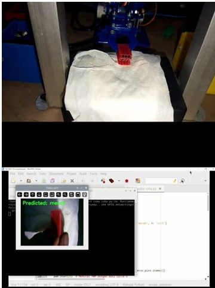
</p>

<p align="center">
  
</p>

The robot detects the red object and moves it toward the designated red sorting location.

---

#### Black Object

<p align="center">
  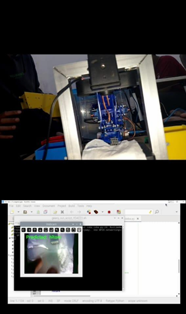
</p>

<p align="center">
  
</p>

The robot detects the black object and moves it toward the designated black sorting location.

The documented testing shows that objects detected by color are placed into sorting boxes corresponding to their detected categories.

---
